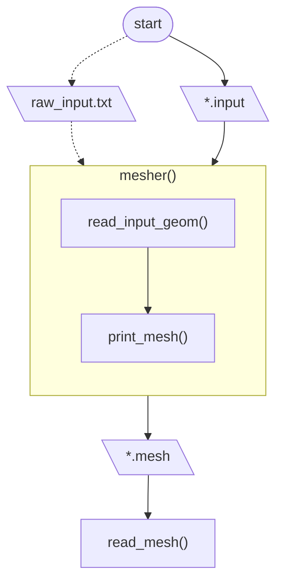

# CFD solver #
The idea is to create a CFD solver from scratch, similar to OpenFOAM

Features:
- CLI-based, but with GUI when defining the simulation
- controlled entirely (under the hood) with plain text file

## Code structure ##



## Notes ##

### Mesh ###
- the LAST keyword-value(s) entry in the `.mesh` file must be `COORDINATES` (the code assumes that from `COORDINATES` onward there are only numbers and nothing more)


#### Example of mesh file ####
```
UNIT
meter

COORDINATES
0
0.1
0.2
```

## Commit messages legend ##

- `TST`: concerns tests
- `DOC`: concerns documentation
- `RFT`: refactoring