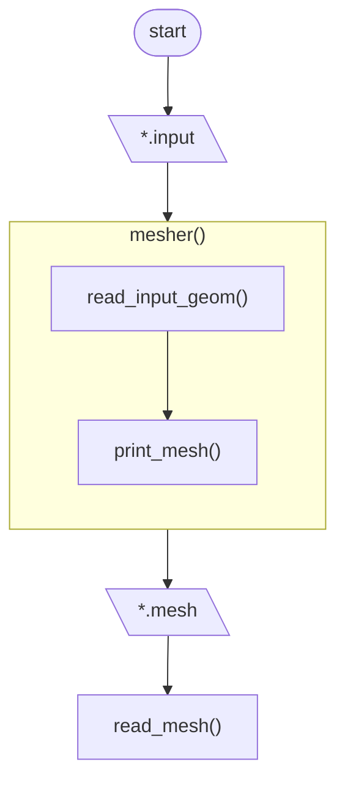

# CFD solver #
The idea is to create a CFD solver from scratch, similar to OpenFOAM

### Features (ideally) ###
- controlled entirely (under the hood) with plain text file
- CLI-based, but with GUI when defining the simulation (similar to FLUENT GUI when choosing the solution schemes: drop-down menus)


## Code structure ##



## I/O files ##

### Gometry input ###
- no check is provided on the units (like ABAQUS and differently from CFX-FLUENT)

#### .input file format ###
```
X0
0

XL
5

N
12

SPACING
uniform

EXPANSION_RATIO
1.2
```


### Mesh ###

#### .mesh file format ####
```
CENTROID COORDINATES
0
0.1
0.2

FACE NODES COORDINATES
-0.05
0.05
0.15
```

## Commit messages legend ##

- `TST`: concerns tests
- `DOC`: concerns documentation
- `RFT`: refactoring
- `BUG`: bugfix

### Rules for semantic versioning ###

Every release is numbered as `MAJOR.MINOR.PATCH`, where:

- `MAJOR` is incremented when an **incomptabile** API change is made
- `MINOR` is incremented when a functionality is added in a **backward compatible**
- `PATCH` is increment when a **backward compatible** bugfix is implemented
- whenever a number is changed, all its children are reset to 0
- if a feature becomes deprecated, issue a new `MINOR` version where the user is notified of the deprecation
- versions `0.x.y` are for initial development (i.e. unstable API)